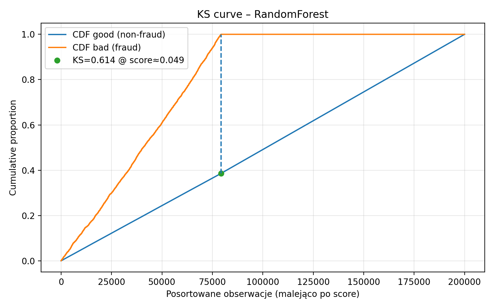
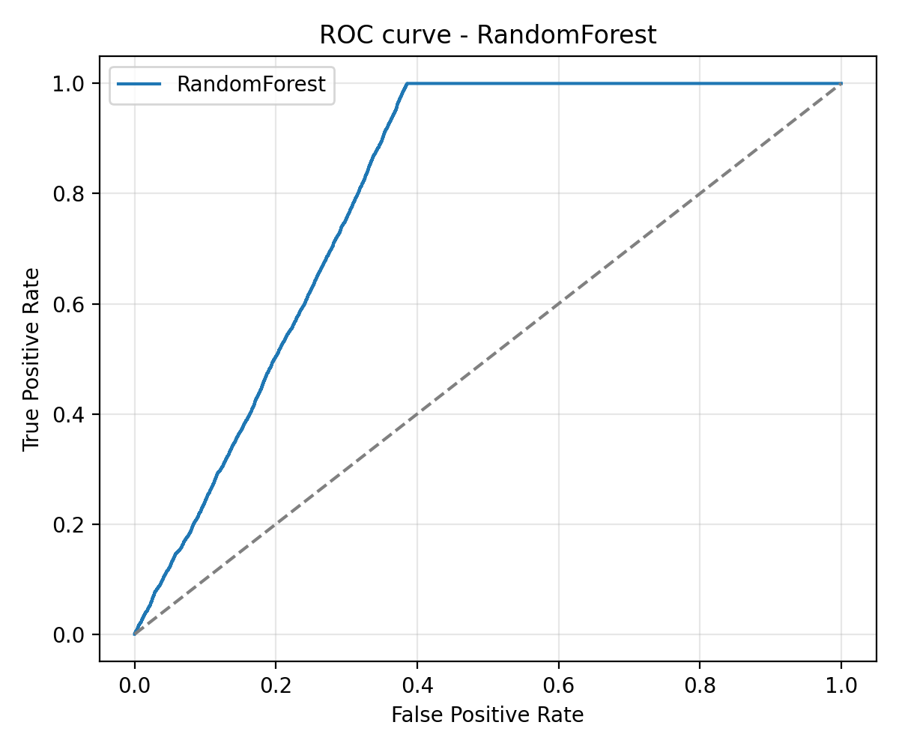
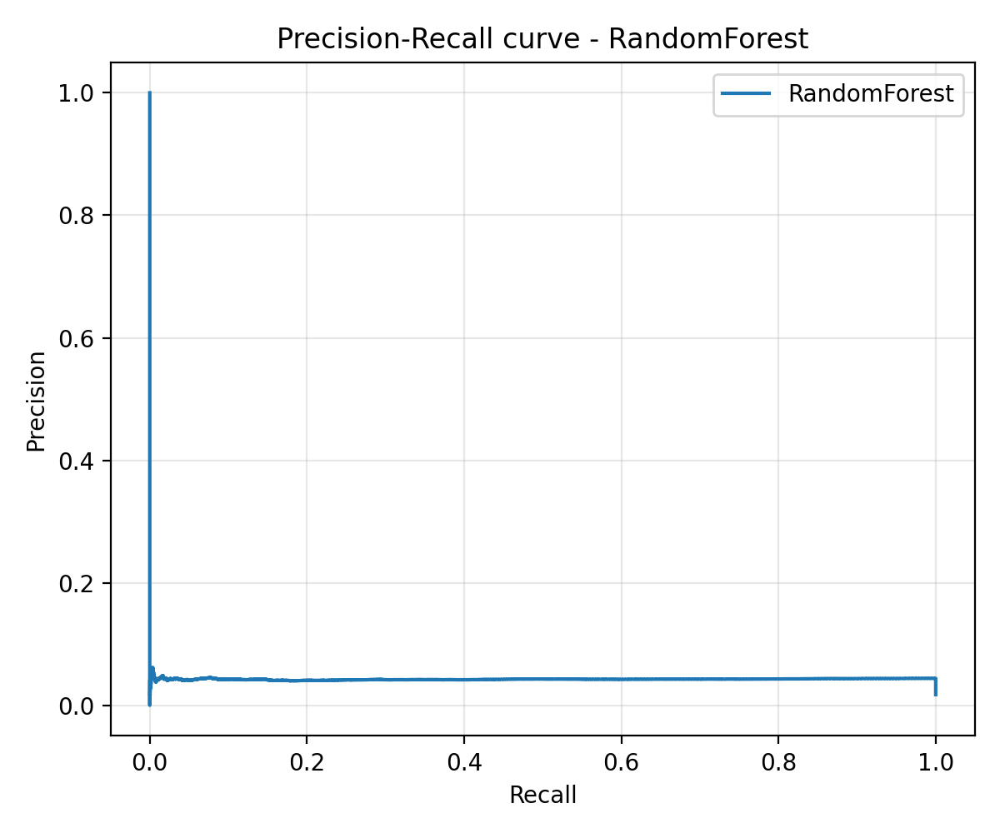
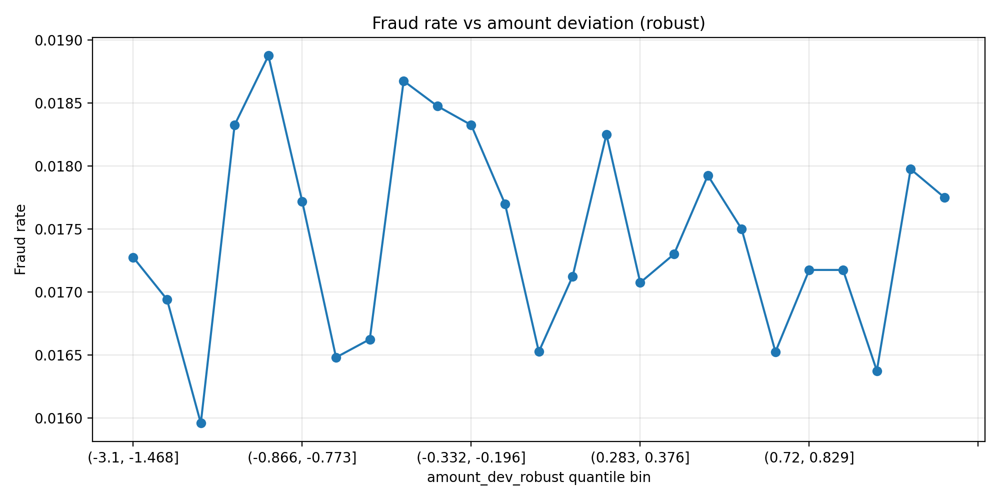
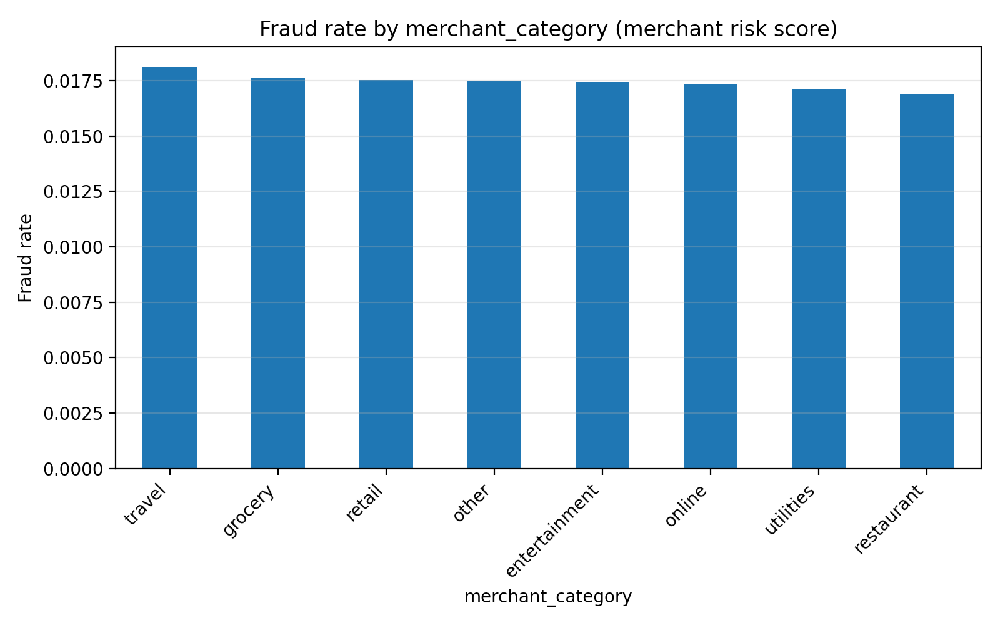

# Detekcja nadużyć finansowych w danych transakcyjnych (fraud detection)

Projekt prezentuje kompletny pipeline analizy nadużyć finansowych na syntetycznym zbiorze transakcji finansowych – od eksploracji danych (EDA), przez inżynierię cech, po modelowanie klasyfikacyjne z uwzględnieniem silnej nierównowagi klas.

Repozytorium jest przygotowane tak, aby dało się uruchomić zarówno szybkie eksperymenty na próbce danych, jak i pełne trenowanie na zbiorze rzędu milionów rekordów.

---

## Kluczowe elementy projektu

- Analiza nierównowagi klas (fraud rate ~1.7% na zbiorze 1M) i jej wpływu na metryki.
- Inżynieria cech:
  - cechy czasowe (`tx_hour`, `tx_dow`, `is_night`),
  - cechy behawioralne (`time_since_last_transaction`, `spending_deviation_score`, `velocity_score`, `geo_anomaly_score`),
  - cecha nietypowości kwoty względem historii klienta (`amount_dev_robust`),
  - prosty *merchant risk score* (`merchant_risk_score`) oparty na fraud rate per kategoria.
- Modelowanie:
  - **Logistic Regression** jako liniowy baseline (z `StandardScaler`),
  - **RandomForestClassifier** jako model nieliniowy.
- Metryki dostosowane do klasy rzadkiej:
  - ROC AUC, PR AUC,
  - statystyka **KS (Kolmogorov–Smirnov)**,
  - progi decyzyjne optymalizowane kosztowo (koszt FP/FN) + *cost sweep*.
- Automatyczne generowanie wykresów (class balance, ROC, PR, KS, boxploty, heatmapa korelacji, wykresy ryzyka merchantów).

Szczegółowy opis analizy znajduje się w pliku `raport.odt` w katalogu głównym repozytorium.

---

## Dane – skrót

Zbiór danych pochodzi z publicznego, syntetycznego zestawu transakcji finansowych:

**Financial Transactions Dataset for Fraud Detection**  
Kaggle: https://www.kaggle.com/datasets/aryan208/financial-transactions-dataset-for-fraud-detection

- Pełny zbiór: **ok. 5 000 000** transakcji (CSV, 18 kolumn).
- Typy informacji:
  - identyfikatory i czas: `transaction_id`, `timestamp`,
  - strony transakcji: `sender_account`, `receiver_account`,
  - kontekst transakcji: `amount`, `transaction_type`, `merchant_category`,
    `location`, `payment_channel`, `device_used`, `ip_address`, `device_hash`,
  - cechy behawioralne:  
    `time_since_last_transaction`, `spending_deviation_score`,
    `velocity_score`, `geo_anomaly_score`,
  - etykieta: `is_fraud` (0/1) oraz pomocniczo `fraud_type`.

Na zbiorze 1 000 000 rekordów użytym do końcowej oceny:

- `fraud_rate ≈ 0.0174` (ok. 1.7% transakcji oznaczonych jako fraud).

W trybie deweloperskim wykorzystywana jest mniejsza próbka (np. 100k), kontrolowana przez konfigurację w `config.py`.

---

## Struktura repozytorium

Przykładowa struktura (ważniejsze elementy):

- `src/`
  - `config.py` – ścieżki do danych, flagi trybu debug (`DEBUG_SMALL_DATA`, `DEBUG_NROWS` itp.).
  - `load_data.py` – wczytywanie CSV, parsowanie `timestamp`, normalizacja `is_fraud`.
  - `features.py` – główny pipeline featurów:
    - `add_time_cols`, `add_numeric_stuff`,
    - `add_amount_deviation_feature` (budowa `amount_dev_robust`),
    - `add_merchant_risk_score`,
    - `one_hot_encode`,
    - `build_X_y` – zwraca macierz `X`, wektor `y` i listę nazw cech.
  - `eda.py` – funkcje EDA (statystyki, wykresy, heatmapa korelacji, Pareto po `merchant_category`, wykres ryzyka merchantów).
  - `modeling.py` – definicje modeli:
    - `build_logreg_model()` – Logistic Regression + `StandardScaler`,
      `class_weight="balanced"`, dostrajany parametr `C`.
    - `build_rf_model()` – RandomForest z `class_weight="balanced_subsample"`
      i zwiększonym `min_samples_leaf`, aby zmniejszyć przeuczenie przy nierównych klasach.
  - `metrics_utils.py` – wspólne metryki i wykresy:
    - `show_metrics`, `best_threshold_by_cost`,
    - `compute_ks`, `plot_ks`,
    - `plot_roc_pr_curves`,
    - `cost_sweep_report` – analiza kosztów w funkcji progu decyzyjnego.
- `scripts/`
  - `run_eda_advanced.py` – pełne EDA, zapis wykresów do `reports/figures/`.
  - `run_training.py` – trenowanie Logistic Regression i RandomForest na wspólnym podziale train/test + raport metryk i wykresów.
- `reports/figures/`
  - generowane automatycznie:  
    `class_balance.png`, `fraud_rate_by_hour.png`,  
    `fraud_vs_log_amount.png`, `amount_hist_overlay.png`,  
    `fraud_vs_amount_deviation.png`, boxploty, `correlation_heatmap.png`,  
    `merchant_risk_score.png`, `roc_*.png`, `pr_*.png`, `ks_*.png`,  
    `cost_sweep_*.png`.

---

## Modelowanie – skrótowe wyniki

Poza klasycznymi metrykami (ROC AUC, PR AUC) analizowano również statystykę KS oraz krzywe kosztu (cost sweep) przy różnych relacjach kosztu FP/FN, co jest typowym podejściem w zastosowaniach scoringowych w finansach.

### Logistic Regression (baseline liniowy)

Model: `LogisticRegression` (w pipeline ze skalowaniem, `class_weight="balanced"`).

Na zbiorze **1 000 000** transakcji (test: 200k):

- **ROC AUC ≈ 0.51**
- **PR AUC ≈ 0.02**
- **KS ≈ 0.04**

Przy progu `0.5`:

- model odzyskuje część fraudów, ale przy bardzo dużej liczbie fałszywych alarmów,
- punkty pracy o akceptowalnej liczbie FP prowadzą do pomijania większości fraudów.

Testowano wpływ regularyzacji (`C`):

> Przy zwiększaniu `C` (słabsza regularyzacja) metryki poprawiają się minimalnie, ale model nadal nie osiąga użytecznej jakości – potwierdza to, że w tym przypadku granica liniowa jest zbyt słaba i potrzebny jest model nieliniowy.

Logistic Regression pełni funkcję modelu referencyjnego, pokazującego dolny poziom jakości i ograniczenia prostych modeli na tego typu danych.

---

### RandomForest (model nieliniowy)

Model: `RandomForestClassifier` z:

- `class_weight="balanced_subsample"`,
- zwiększonym `min_samples_leaf`, aby ograniczyć przeuczenie przy silnej nierównowadze klas.

Na zbiorze **1 000 000** transakcji (test: 200k):

- **ROC AUC ≈ 0.80**
- **PR AUC ≈ 0.043**
- **KS ≈ 0.61** (przy sensownych progach decyzyjnych).

Zastosowano analizę progu decyzyjnego z kosztami:

- koszt FP = 1 (fałszywy alarm),
- koszt FN ∈ {5, 10, 20, 50, 100} (przeoczony fraud),
- dla każdego kosztu wyszukiwany jest próg minimalizujący łączny koszt `FP * cost_fp + FN * cost_fn`,
- wyniki zapisywane są w postaci tabeli i wykresu `cost_sweep_<Model>.png`.

Przy wysokim koszcie FN (np. 50–100):

- optymalne progi przesuwają się w dół (więcej alertów, wyższy recall),
- liczba FP rośnie, ale udział przeoczonych fraudów spada prawie do zera.

---

### Uwagi o przeuczeniu (różnica między 100k a 1M)

Pierwsze eksperymenty były prowadzone na próbce **100 000** wierszy:

- RandomForest na 100k:
  - ROC AUC ≈ 0.97–0.98,
  - KS ≈ 0.90–0.95.

Tak wysokie wartości – przy stosunkowo małej próbce i nierównowadze klas – wskazywały na przeuczenie.

Po przejściu na zbiór **1 000 000**:

- metryki ustabilizowały się na bardziej realistycznym poziomie (ROC AUC ≈ 0.80, KS ≈ 0.61),
- dodatkowo zwiększono `min_samples_leaf` w modelu RandomForest, aby wymusić bardziej „gładkie” drzewa decyzyjne i lepsze uogólnienie.

Informacja o wcześniejszych wynikach została pozostawiona, aby pokazać proces dochodzenia do konfiguracji modelu adekwatnej do skali i charakterystyki danych.

---
## Przykładowe wizualizacje

Wybrane wykresy przedstawiają charakterystykę danych oraz kluczowe wyniki modelowania.  
Pełna lista znajduje się w katalogu `reports/figures/`.

### 1. KS curve (RandomForest)
Krzywa ilustruje wartość statystyki KS oraz poziom separacji między klasami w rozkładzie predykcji.

### 2. ROC curve (RandomForest)
Krzywa ROC przedstawiająca relację między TPR i FPR w pełnym zakresie progów decyzyjnych.

### 3. Precision–Recall curve (RandomForest)
Krzywa PR pokazująca zależność między precision i recall dla rzadkiej klasy pozytywnej.

---

### 4. Fraud rate vs amount deviation (`amount_dev_robust`)
Wykres prezentuje zależność między odchyleniem kwoty transakcji od typowego poziomu dla danego nadawcy a obserwowanym fraud rate.

### 5. Merchant risk score
Wizualizacja przedstawia historyczny fraud rate dla poszczególnych kategorii merchantów, uporządkowanych rosnąco według ryzyka.

---

> Pozostałe wykresy (m.in. heatmapa korelacji, boxploty cech behawioralnych, histogramy, cost sweep) znajdują się w katalogu `reports/figures/`.

---

## Technologie

- Python 3.x
- pandas, NumPy
- scikit-learn
- matplotlib
- seaborn (wybrane wizualizacje EDA)

---

## Uruchamianie projektu

### 1. Wymagania

- Python 3.10+
- pip
- lokalny plik CSV z danymi transakcyjnymi  
  (ścieżka ustawiana w `src/config.py` → `DATA_PATH`)

---

### 2. Instalacja

    git clone https://github.com/Dywan-na-palacach/fraud-detection-pipeline.git
    cd <repo>

    python -m venv .venv
    # Windows
    .venv\Scripts\activate
    # Linux/Mac
    source .venv/bin/activate

    pip install -r requirements.txt

Następnie ustaw ścieżkę danych w:

    src/config.py

Opcjonalnie możesz ustawić:

- `DEBUG_SMALL_DATA = True`
- `DEBUG_NROWS = 100_000` lub `1_000_000`

w zależności od tego, czy projekt ma działać na pełnym zbiorze, czy na próbce.

---

## Analiza eksploracyjna (EDA)

### Uruchamianie

    python scripts/run_eda_advanced.py

Skrypt wykonuje:

- wczytanie danych,
- budowę macierzy cech,
- statystyki i wizualizacje,
- zapis wykresów do `reports/figures/`.

Analizowane są m.in.:

- balans klas,
- rozkład kwot,
- anomalie behawioralne,
- segmentowe wskaźniki ryzyka (`merchant_category`, `payment_channel`, itd.),
- zależności fraudów od cech numerycznych i czasowych.

---

## Trenowanie modeli

### Uruchamianie

    python scripts/run_training.py

Skrypt:

1. tworzy macierz cech `X` i etykiety `y`,
2. wykonuje podział train/test z zachowaniem balansu klas,
3. trenuje modele:
   - Logistic Regression (baseline),
   - RandomForestClassifier,
4. oblicza metryki:
   - ROC AUC, PR AUC,
   - macierze pomyłek,
   - statystykę KS,
5. dokonuje analizy progu decyzyjnego (cost-sensitive thresholding),
6. generuje wykresy:
   - ROC,
   - Precision–Recall,
   - KS,
   - cost sweep.

Wszystkie pliki trafiają do:  
`reports/figures/`.

---

## Przykładowe wyniki (skrót)

### Logistic Regression
- ROC AUC ≈ 0.51  
- PR AUC ≈ 0.02  
- KS ≈ 0.04  
Model pełni funkcję referencyjną — potwierdza, że prosta granica liniowa jest niewystarczająca w warunkach silnej nierównowagi klas.

### RandomForest
- ROC AUC ≈ 0.80  
- PR AUC ≈ 0.043  
- KS ≈ 0.61  
- dobrze generalizuje na zbiorze 1M (próbka 100k była przeuczona).  

Wyniki wskazują na konieczność stosowania progów niższych niż 0.5.

---
## Integracja z SQL

Struktura tabeli odpowiada schematowi przyjmowanemu przez pipeline w `src/features.py` (`build_X_y`), dzięki czemu dane mogą być przygotowywane w bazie, a następnie bezpośrednio wczytywane do modelowania w Pythonie.

Repozytorium zawiera dwa skrypty SQL wspierające przygotowanie danych:

### `sql/schema.sql`
Definicja tabeli `transactions` z pełnym zestawem pól wykorzystywanych w modelowaniu
(identyfikatory, znacznik czasu, parametry transakcji, cechy behawioralne, informacje o urządzeniu, etykieta `is_fraud`).  
Plik umożliwia odtworzenie struktury danych w relacyjnej bazie (np. PostgreSQL).

### `sql/window_features.sql`
Przykładowe obliczenia cech z użyciem funkcji okienkowych, m.in.:
- średnia krocząca kwoty w ramach nadawcy (rolling window),
- z-score kwoty per klient.

Skrypty pokazują sposób przeniesienia części feature engineeringu do warstwy SQL, co umożliwia przygotowanie danych po stronie bazy przed ich wykorzystaniem w Pythonie.

---
## Kluczowe wizualizacje

EDA:

- `class_balance.png`
- `fraud_rate_by_hour.png`
- `fraud_vs_log_amount.png`
- `fraud_vs_amount_deviation.png`
- `correlation_heatmap.png`
- `merchant_risk_score.png`

Modeling:

- ROC — Logistic Regression / RandomForest
- PR — Logistic Regression / RandomForest
- KS — Logistic Regression / RandomForest
- Cost sweep dla LR i RF

---

## Możliwe kierunki dalszej pracy

- balansowanie klas: undersampling, SMOTE,
- modele boostingowe (LightGBM, XGBoost),
- analiza ważności cech: SHAP, permutation importance,
- walidacja czasowa i analiza driftu,
- integracja z SQL oraz przygotowanie dashboardu.
